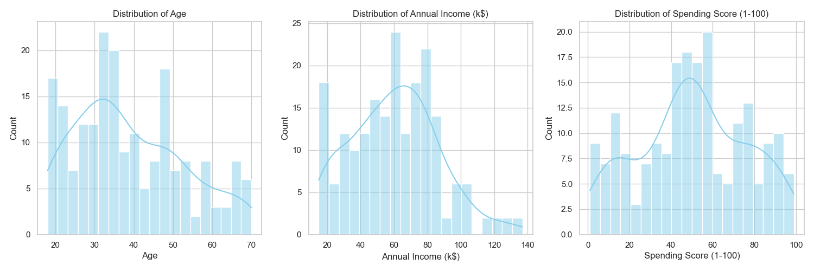
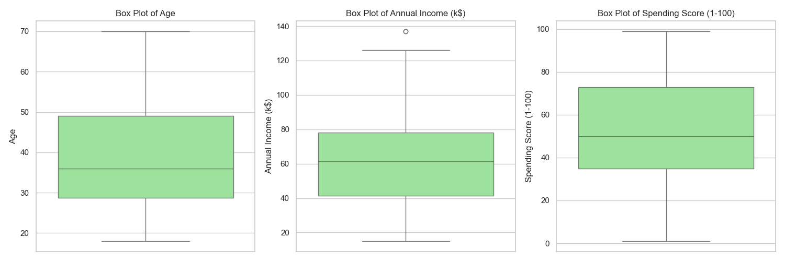
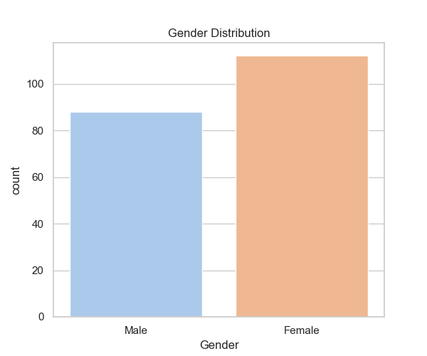
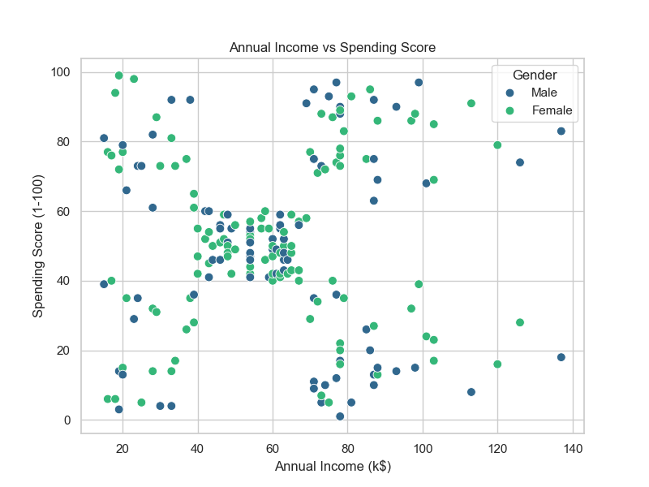

# CA1: Data Mining (PEC-AIML601B)
## Exploratory Data Analysis of Mall Customers Using Descriptive Statistics

**Deliverable**: Assignment Report & Verification of Code

---

## 1. Introduction & Objectives
This report details the Exploratory Data Analysis (EDA) performed on the Mall Customers dataset. The analysis aims to understand customer demographics and spending behavior to aid in data-driven marketing strategies.

**Objectives:**
- Understand dataset structure.
- Apply descriptive statistics (Central Tendency, Dispersion).
- Analyze distributions and identify outliers.
- Visualize relationships between variables.
- Derive actionable business insights.

---

## 2. Dataset Overview & Data Understanding
The dataset consists of customer information from a mall, including ID, Gender, Age, Annual Income, and Spending Score.

### Code: Loading and Inspection
```python
import pandas as pd

# Load Dataset
df = pd.read_csv('Mall_Customers.csv')

# Rename Genre to Gender for consistency
if 'Genre' in df.columns:
    df.rename(columns={'Genre': 'Gender'}, inplace=True)

# Display Info
print(f"Shape: {df.shape}")
print(f"Missing Values:\n{df.isnull().sum()}")
```

### Analysis Results
- **Records**: 200
- **Attributes**: 5
    - `CustomerID`: Integer (ID)
    - `Gender`: Categorical (Male/Female)
    - `Age`: Numerical (Integer)
    - `Annual Income (k$)`: Numerical (Integer)
    - `Spending Score (1-100)`: Numerical (Integer)
- **Missing Values**: 0 (Clean dataset)

---

## 3. Measures of Central Tendency
We analyzed the Mean, Median, and Mode to understand the "typical" customer profile.

### Code
```python
numerical_cols = ['Age', 'Annual Income (k$)', 'Spending Score (1-100)']
for col in numerical_cols:
    print(f"{col} -> Mean: {df[col].mean():.2f}, Median: {df[col].median():.2f}, Mode: {df[col].mode()[0]}")
```

### Results Table
| Attribute | Mean | Median | Mode | Interpretation |
|---|---|---|---|---|
| **Age** | 38.85 | 36.00 | 32 | The average customer is around 39 years old. |
| **Annual Income (k$)** | 60.56 | 61.50 | 54 | Average income is ~$60.5k, indicating a middle-class customer base. |
| **Spending Score** | 50.20 | 50.00 | 42 | Spending score is balanced, centered around 50. |

---

## 4. Measures of Dispersion
Dispersion metrics help us understand the spread and variability of the data.

### Code
```python
for col in numerical_cols:
    data_range = df[col].max() - df[col].min()
    var = df[col].var()
    std = df[col].std()
    Q1 = df[col].quantile(0.25)
    Q3 = df[col].quantile(0.75)
    IQR = Q3 - Q1
    print(f"{col} -> Range: {data_range}, STD: {std:.2f}, IQR: {IQR}")
```

### Results Table
| Attribute | Range | Variance | Std Dev | IQR | Interpretation |
|---|---|---|---|---|---|
| **Age** | 52 | 195.13 | 13.97 | 20.25 | Moderate spread in age. |
| **Annual Income (k$)** | 122 | 689.84 | 26.26 | 36.50 | High variation in income levels. |
| **Spending Score** | 98 | 666.85 | 25.82 | 38.25 | Wide variety of spending habits. |

---

## 5. Distribution Analysis & Outliers
We checked the shape of the data distribution and looked for anomalies.

### Code: Skewness & Outliers
```python
from scipy.stats import skew
for col in numerical_cols:
    s = skew(df[col])
    print(f"{col} Skewness: {s:.2f}")
    # Outlier logic (1.5 * IQR)
```

### Results
- **Age**: Skewness 0.48 (Approx. Symmetric). No outliers.
- **Annual Income**: Skewness 0.32 (Approx. Symmetric). **2 Potential Outliers** detected (> 130k).
- **Spending Score**: Skewness -0.05 (Approx. Symmetric). No outliers.

---

## 6. Categorical Data Analysis
Analyzing the Gender distribution.

### Code
```python
print(df['Gender'].value_counts())
print(df['Gender'].value_counts(normalize=True))
```

### Insight
- **Female**: 112 (56.0%)
- **Male**: 88 (44.0%)
- The customer base has a slightly higher female presence.

---

## 7. Visualization
Visual representations provide intuitive insights.

### 7.1 Histograms (Distribution)

*Observation*: Age is slightly right-skewed. Spending score is normally distributed.

### 7.2 Box Plots (Outliers)

*Observation*: Annual Income clearly shows the outliers on the higher end.

### 7.3 Bar Chart (Gender)

*Observation*: Visual confirmation of the female majority.

### 7.4 Scatter Plot (Bivariate Analysis)
**Annual Income vs Spending Score**

*Observation*: This is the most critical plot. It shows 5 distinct clusters of customers:
1. Low Income, Low Spend
2. Low Income, High Spend
3. Average Income, Average Spend
4. High Income, Low Spend
5. High Income, High Spend

---

## 8. Business Insights & Implications
Based on the analysis, here are the key takeaways for the marketing strategy:

1.  **Target the "High Spenders"**: There are distinct groups of high spenders. One group has high income (Premium customers), and another has low income (possibly students or impulse buyers). Marketing messages should differ for these two groups.
2.  **Focus on Women**: With 56% female customers, campaigns featuring products for women might yield higher ROI.
3.  **Prime Demographic**: The core age group is 30-40 (Mean: 39, Mode: 32). Products targeting young professionals and parents would likely succeed.
4.  **Retention Strategy**: The "Average Income, Average Spend" group (the dense center cluster) is the backbone of the business. Loyalty programs should be designed to keep them engaged.
5.  **Luxury Segment**: The high-income outliers and the high-income/high-spend cluster represent a luxury market opportunity. Exclusive offers could be targeted here.

---
**Prepared by**: [Amitava Datta/13030823014]
**Tool Used**: Python (Pandas, Seaborn, Matplotlib)
